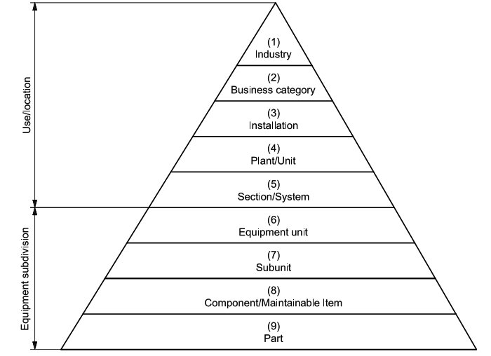

# sap-tools

A collection of tools for working with SAP data:
1) tree_processing
2) materials_semantic_search

## tree_processing
A module to process tree data into materialised path and column store data. This allows tree data to be efficiently traversed without slow, recursive queries.

Most notably, this could be applied to SAP Functional Location data. Functional Location data often follow an ISO 14224 maintenance taxomomy as shown:

In an adjacency list representation, eg as exported using SAP transaction IH06, the data might be represented as follows, where each node refers to the id of its parent:

| functional_location | description | parent functional location|
|--- | --- | --- |
|industry_1 | A root node of the tree | (None) |
|business_category_1 | A level 2 node | industry_1 |
|business_category_2 | A level 2 node | industry_1 |
|installation_1 | A level 3 node | business_category_1 |
|installation_2 | A level 3 node | business_category_1 |
|installation_3 | A level 3 node | business_category_2 |
|plant_1 | A level 4 node | installation_1 |
|plant_2 | A level 4 node | installation_1 |
| (etc) | |  |

Traversing this tree is slow, because it takes a query to get the root nodes, then additional queries to retrieve the children, then additional queries to retrieve their grandchildren, and so on. The total number of queries required is equal to the number of nodes divided by the average number of children per node.

By representing the data in 'materialised path form', it means that the full path to each node is shown, e.g. as follows:

| functional_location | description | parent functional location| materialised_path |
|--- | --- | --- | --- |
|industry_1 | A root node, ISO14224 level=1 (depth = 0) | (None) | industry_1 |
|business_category_1 | A level 2 node (depth=1) | industry_1 | industry_1 > business_category_1|
|business_category_2 | A level 2 node (depth=1) | industry_1 | industry_1 > business_category_2|
|installation_1 | A level 3 node (depth=2) | business_category_1 | industry_1 > business_category_1 > installation_1|
|installation_2 | A level 3 node (depth=2) | business_category_1 | industry_1 > business_category_1 > installation_2|
|installation_3 | A level 3 node (depth=2) | business_category_2 |  industry_1 > business_category_2 > installation_3|
|plant_1 | A level 4 node (depth=3) | installation_1 | industry_1 > business_category_1 > installation_1 > plant_1 |
|plant_2 | A level 4 node (depth=) | installation_1 | industry_1 > business_category_1 > installation_1 > plant_2 |
| (etc) | |  |

Then, the nodes tree could quickly be sorted into depth-first order simply by sorting on the materialised_path column, and the complete set of descendands of a given node could be found with a single SELECT query using the pattern:

    SELECT * FROM ih01_data WHERE ih01_data.materialised_path LIKE 'target_materialised_path%'

The function also populates twelve levels of columns following the following pattern

| L00_desc | L01_desc |  L02_desc | etc |
|--- | --- | --- | --- |
| id - description  for depth 00 node | id - description  for depth 01 node (if applicable) | id - description  for depth 02 node (if applicable) || --- |
| id - description  for depth 00 node | id - description  for depth 01 node (if applicable) | id - description  for depth 02 node (if applicable) || --- |
| id - description  for depth 00 node | id - description  for depth 01 node (if applicable) | id - description  for depth 02 node (if applicable) || --- |

These extra columns can be added into a PowerBI hierarchy, giving a powerful way to filter using the tree hierarchy, (eg quickly filter to all maintenance within the power generation system)

The function also computes the depth, and the number of children for each node.

## materials_semantic_search

This workbook performs semantic search of SAP materials data. To do this, it builds transformer embeddings on the reference dataset, and compares a given search term to these embeddings using a cosine similarity metric.
